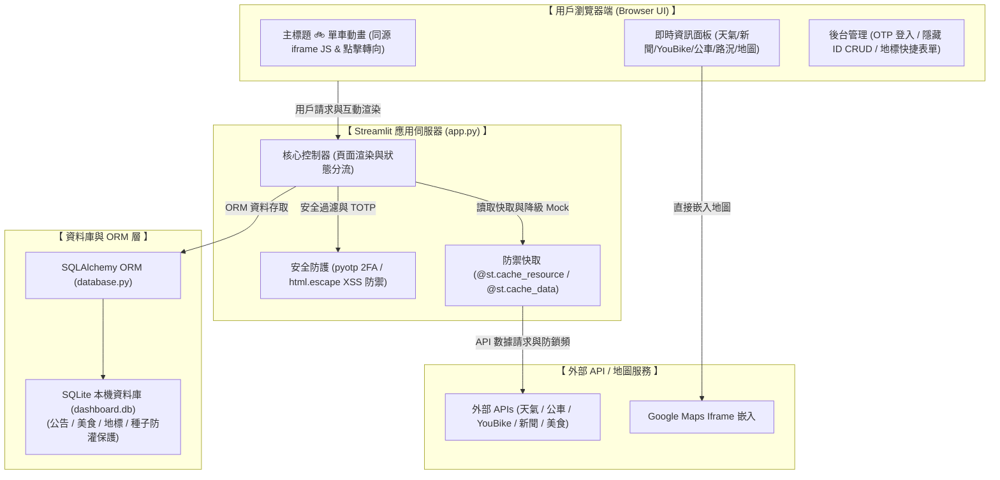

# Survival Dashboard

本專案是一個即時生活資訊儀表板，整合了天氣預報、新聞頭條、YouBike 2.0 即時站點、公車到站資訊、即時路況監控、周邊地圖與美食推薦，並包含安全雙重驗證的後台 CRUD 管理系統。目標群眾是台北市區的辛苦通勤上班族，方便一覽用餐及上下班時間的即時戰報。

---

## 🏗️ 系統架構 (System Architecture)

以下為本專案的系統運作架構圖，展示了前端瀏覽器互動、Streamlit 伺服器核心、安全防護與外部 API/資料庫的整合關係：

---

## 🛠️ 技術與架構特色
* **網頁前端與互動**：Streamlit (Python 響應式網頁框架)
* **資料儲存**：SQLite (本機內嵌型資料庫 `dashboard.db`)
* **資料庫 ORM**：SQLAlchemy
* **雙重安全驗證 (2FA)**：使用 `pyotp` 串接 Google Authenticator TOTP 動態密碼。
* **外部 API 與套件**：
  * 中央氣象署 (CWA) 天氣 API
  * 台北市與國道 VD 路況 API / 公車到站動態 API / YouBike 2.0 API
  * Google Places API (美食搜尋)
  * `feedparser` (Google 新聞 RSS 串接)
* **資料介接與防禦快取**：
  * 使用 Streamlit 全域快取裝飾器限制第三方 API 連線頻率，防止來源 IP 被限制或鎖定。
  * 針對公車靜態站點資料，採用 `@st.cache_resource` 進行快取，防止重新整理時重複進行 Pickle 深拷貝反序列化的負擔。
  * 導入經緯度 Bounding Box 粗篩過濾，減少 99.5% Haversine 三角函數運算，提昇效能。
  * 容錯降級機制：當 API 斷網、請求超時或連線失敗時，自動顯示最後一次成功快取的暫存資料或高擬真 Mock 資料。

---

## 🎨 重點功能與互動展示說明

### 📌 互動式標題腳踏車動畫
* **無分隔線設計**：主標題下方的雙底線已移除，腳踏車 `🚲` 直接流暢地在標題正下方行進，版面更為乾淨。
* **動態點擊即時轉向**：
  * 透過同源屬性 `window.parent.document` 對父頁面的 DOM 進行操作，在標題載入後掛載腳踏車 `🚲`。
  * 擴充腳踏車點擊熱區（`padding: 10px 15px`），滑鼠點擊時立刻切換行進方向 (`dir = -dir`)，並透過 `scaleX` 鏡像翻轉，確保腳踏車車頭朝向始終與前進方向一致。
  * 包含頁面重新渲染偵測，舊的動畫循環會自動退出，避免 memory leak。

### 📌 即時生活資訊

1. **即時天氣監控**：
   * 針對指定位置定位，展示即時溫度、體感溫度、降雨機率與天氣現象。
   * **水平平行排版**：左側為超大目前溫度字體；右側以一根左邊框線隔開，並排顯示天氣現象、體感溫度與降雨機率。
   * **Unicode 圖示化**：將天氣現象動態解析並替換為單色 Unicode 圖示（如 `⛈️`、`🌧️`、`☁️`、`☀️` 等）。
   * **溫度與體感溫度分色**：溫度大於等於 30°C 顯示為紅色 (`#CC0000`)；介於 20°C 至 29°C 顯示為綠色 (`#00AA00`)；低於 20°C 顯示為藍色 (`#0000AA`)。
   * **降雨機率分色**：降雨機率小於等於 30% 顯示為藍色 (`#0000AA`)；大於 30% 顯示為紅色 (`#CC0000`)。
   * **XSS 安全防禦**：針對所有自訂 HTML 渲染的動態定位點名稱與更新時間，使用 `html.escape()` 進行跳脫防護。

2. **新聞頭條**：
   * 即時串接 Google 台灣區頭條新聞 RSS，將最新鮮的新聞**依發布時間由新到舊降序排列**，最多展示前 25 則。
   * **卡片式排版與溢出忽略**：新聞卡片限制為固定的 `height: 105px; overflow: hidden;` 大小，新聞標題最多顯示兩行，並在滑鼠懸浮時呈現 translate 向上漂浮微動畫。
   * **點選卡片另開分頁**：卡片包裹於 `_blank` 連結中，點擊即可於新分頁查看完整新聞。

3. **YouBike 站點**：
   * 根據「平台中心定位設定」的當前經緯度來動態計算 Haversine 距離，並重新動態排序、選出最近的 TOP 3 站點進行展示。
   * **可借車分色**：預設為深藍色 (`#0000AA`)，若小於等於 2 輛則變為紅色 (`#CC0000`) 警示。
   * **可還車分色**：預設為深綠色 (`#00AA00`)，若小於等於 2 輛則變為紅色 (`#CC0000`) 警示。

4. **公車即時到站與 Gzip 容錯**：
   * 使用 Flexbox 獨立卡片清單。每條路線均為獨立且帶有白色底色、直角邊框的卡片，間距自然露出背景色。
   * **分色與緊迫警告**：「去程」整行文字為深藍色 (`#0000AA`)；「返程」整行文字為深綠色 (`#00AA00`)。若到站時間 $\le$ 2 分鐘（含「即將到站」），該欄位會轉為紅色 (`#CC0000`) 加粗。
   * **Gzip HTML 錯誤攔截**：防禦政府 API 故障（回傳 500 HTML 卻包裝在 Gzip 中），在解壓縮第一時間偵測內容是否為 HTML 標籤，若是則拋出明確異常並進入防禦 Fallback 流程，保護網頁不崩潰。

5. **🚗 即時路況監控**：
   * **地理圍欄限制**：若中心定位點非「台北市」，系統將會以黃色警告框提示不支援。
   * **週邊過濾與半徑擴充**：定位在台北市區內時，系統會篩選出最接近當前定位點的 6 個主要觀測點路況。若 5 公里內無觀測點，會自動將搜尋半徑擴大至 10 公里。
   * **雙向車速與路況事件**：
     * 左側「週邊道路車流速限」：標示各觀測點的方向與車速，並以紅（壅塞）、黃（車多）、綠（順暢）三色標註。
     * 右側「即時路況突發事件」：若有突發事件，會以紅/黃邊框的警示卡片呈現詳細文字與事件發生時間。

6. **周邊地圖與美食推薦**：
   * 地圖採用穩定的 Google Maps 簡化版 Iframe 嵌入。
   * 美食推薦：有 Google Places API 金鑰時，動態搜尋 1500m 內 20 家餐廳，並有 `st.spinner` 動態載入動畫；無金鑰或 API 失敗時，會自動 fallback 至本地 SQLite 資料庫。統一摺疊面板（`st.expander`）套用 `#FFFFFF` 背景提昇易讀性。

7. **常用地標定位與行政區快取連動**：
   * 下拉選單中包含 **`南港新富公園`**（富康公園）、**`統一數位大樓 (內湖石潭路155號)`** 等。
   * 內建預置座標與行政區快速比對，自動判定並顯示為對應的台北行政區。

8. **便捷控制與導覽**：
   * **手動更新按鈕**：右上角點擊重刷（採用 Base64 編碼的 `UPDATE.png` 圖示），強制清除 API 快取，防止循環重刷。
   * **回到最上方按鈕**：右下角固定定位 `BackToTop_2.png` 浮動按鈕，懸停放大 10% 且觸發 Newsprint 黑白反色濾鏡，點選平滑捲動回頂部。

---

## 🔐 後台管理系統 (CRUD)

1. 展開左側側邊欄，勾選「**切換至後台管理**」。
2. **Google TOTP 二重安全驗證**：
   * **首次登入**：若為首次登入（或未綁定狀態），系統將顯示 QR Code 與金鑰。使用手機的 **Google Authenticator** App 掃描條碼，輸入產生的 6 位數密碼即可登入並完成安全綁定。
   * **後續登入**：無須再輸入固定密碼，每次登入均要求輸入手機 Authenticator App 上顯示的 6 位動態密碼。
3. **ID 隱藏與可編輯表格**：
   * 公告、美食、常用地標的管理表格皆透過 `st.data_editor` 呈現。
   * 表格中**已完全隱藏資料庫的 `id` 欄位**，避免隨機 UUID 造成使用者視覺混亂。
4. **常用地標快捷表單與 Option B 種子防禦**：
   * 地標管理區塊上方設有簡易表單，輸入「地標名稱」及「經緯度」即可一鍵新增地標。
   * 支援將地標清單完全刪除。清空地標後，資料庫會將 `has_seeded_landmarks` 設為 `True`，確保**重啟伺服器或重新整理頁面時，系統不會重複灌入預設種子資料**。

---

## 📌 版本控制與開發部署
1. 本專案已初始化 Git 版本控制，並排除敏感環境設定（`.env`）與本地資料庫檔案（`dashboard.db`），確保代碼庫的乾淨與安全。
2. **遵守嚴格的部署權限規範**：除非使用者明確發出指令要求（如「上git」、「commit」、「push」），否則地端 Agent 絕對不會擅自對 GitHub 倉庫進行任何提交與推送操作。

